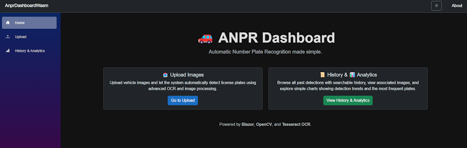
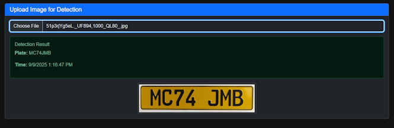
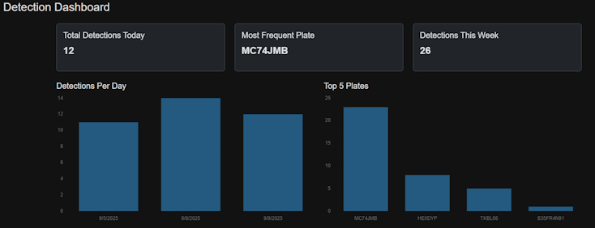
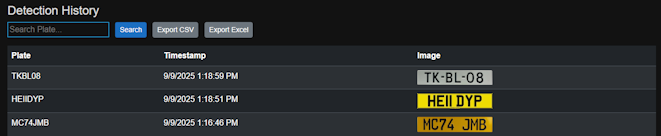

# ANPR Dashboard

A Blazor & .NET application for uploading vehicle images, detecting license plates (OCR or mock), and tracking detection history in SQLite. Features real-time updates via SignalR, analytics charts, and a responsive UI for viewing detections and original images.

<p align="center">
  
</p>

---

## Features

- Upload vehicle images and detect license plates (OCR via Tesseract.NET)
- Store detection history in SQLite with plate number, timestamp, and file path
- Search and filter detection history
- Real-time notifications via SignalR
- Analytics: detections per hour/day, top 5 plates
- Click a history record to view the original uploaded image
- Responsive UI with charts, cards, and tables
- CSV and Excel plate history export

---

## Getting Started

### Prerequisites

- [.NET 8 SDK](https://dotnet.microsoft.com/en-us/download/dotnet/8.0)
- [Visual Studio 2022/2023](https://visualstudio.microsoft.com/) or VS Code

### Setup

1. Clone the repository:
   ```bash
   git clone https://github.com/ClionaHayden/ANPR-Dashboard.git
   
2. Navigate to the server project and run migrations if needed:
     ```bash
     cd AnprDashboardServer
     dotnet ef database update
3. Run the server:
     ```bash
     dotnet run
4. Run the Blazor client:
     ```bash
     cd AnprDashboardWasm
     dotnet run
5. Open your browser at http://localhost:5286 (adjust port if different).

---
## Usage

1. **Upload Images**  
   - Use the upload form on the dashboard to submit vehicle images.
   - The system detects license plates using OCR (Tesseract.NET).
<p align="center">
  
</p>

2. **Analytics & Charts**  
   - View visual analytics such as:
     - Detections per hour/day
     - Top 5 most frequent plates
   - Charts update automatically as new detections arrive.
<p align="center">
  
</p>

3. **View Detections**  
   - Newly detected plates appear in the **Detection History** table in real time.
   - Each record shows: Plate number, Timestamp, and File path.
   - Click a row to view the original uploaded image.

4. **Filtering & Searching**  
   - Filter history by plate number or date.
   - Sort records to quickly find relevant detections.

5. **Export History**  
   - Export detection history to **CSV** or **Excel** for offline analysis.
   - Supports sharing data or further processing in spreadsheet tools.
<p align="center">
  
</p>

---
## License
   This project is licensed under the MIT License. See the LICENSE file for details.
